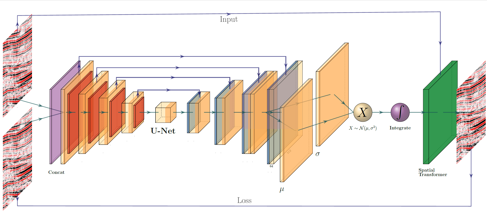

# Deep Unsupervised 4D Seismic 3D Time-Shift Estimation with Convolutional Neural Networks
This code is a fork of the medical [https://github.com/voxelmorph/voxelmorph](Voxelmorph) code from MIT released under the GPL license. Check out their repo for implementation details and more information, as well as further developments.



This way of warping seismic images uses a CNN at it's core to extract the warping vectors but leaves the warping to a non-learning transformation layer. This ensures that amplitudes are preserved. The diffeomorphic implementation ensures that the warp field does not introduce crossing reflectors to "find an optimal fit", which is called topology-preserving. This is merging machine learning math and geological intuition to provide minial but working constraints.

Read the full preprint on [EarthArxiv](https://eartharxiv.org/82bnj/).

# Instructions
This is very much research code. We apologize.
## Setup
In the case you cloned this repository, you have to set up the resources as follows (Unix-based systems):

```
export PYTHONPATH=$PYTHONPATH:/path/to/voxelmorph/ext/neuron/:/path/to/voxelmorph/ext/pynd-lib/:/path/to/voxelmorph/ext/pytools-lib/
```

You have to replace `/path/to/voxelmorph/`. Generate the right command using `src/path.py`. 

## Training
The training was done using `src/train_segy.py`, it uses two in-memory numpy array, which are hardcoded in the training file. Adjust these accordingly. Afterwards you can run the code with:

    python train_segy.py

There are several useful parameters (with defaults) such as:

    --data_dir "/path/to/your/data/"
    --model_dir "/path/to/your/model/"
    --gpu "0"    # With your gpu id
    --lr 1e-4    # Providf a different learning rate
    --epochs 350 # Number of iterations

## Warping
The warping is done in the `src/register_segy.py`, again with hardcoded files. Adjust accordingly.

# Papers
These are resulting papers from this work. Please cite accordingly (see [bibtex](citations.bib))

#### Deep Unsupervised 4D Seismic 3D Time-Shift Estimation with Convolutional Neural Networks
[Dramsch, J. S.](https://dramsch.net), [Christensen, A. N.](https://www.dtu.dk/service/telefonbog/person?id=36350), [MacBeth, C.](https://researchportal.hw.ac.uk/en/persons/colin-macbeth), & [Lüthje, M](https://www.dtu.dk/english/service/phonebook/person?id=11047).

eprint EarthArxiv:82bnj. (2019, October 31). [10.31223/osf.io/82bnj](https://doi.org/10.31223/osf.io/82bnj).

## Voxelmorph
If you use voxelmorph or some part of the code:

### Diffeomorphic Probabalistic
For the diffeomorphic or probabilistic model:

#### Unsupervised Learning of Probabilistic Diffeomorphic Registration for Images and Surfaces
[Adrian V. Dalca](http://adalca.mit.edu), [Guha Balakrishnan](http://people.csail.mit.edu/balakg/), [John Guttag](https://people.csail.mit.edu/guttag/), [Mert R. Sabuncu](http://sabuncu.engineering.cornell.edu/)  

MedIA: Medial Image Analysis. 2019. [eprint arXiv:1903.03545](https://arxiv.org/abs/1903.03545) 

#### Unsupervised Learning for Fast Probabilistic Diffeomorphic Registration
[Adrian V. Dalca](http://adalca.mit.edu), [Guha Balakrishnan](http://people.csail.mit.edu/balakg/), [John Guttag](https://people.csail.mit.edu/guttag/), [Mert R. Sabuncu](http://sabuncu.engineering.cornell.edu/)  
MICCAI 2018. [eprint arXiv:1805.04605](https://arxiv.org/abs/1805.04605)

### Original CNN
For the original CNN model, MSE, CC, or segmentation-based losses:

#### VoxelMorph: A Learning Framework for Deformable Medical Image Registration
[Guha Balakrishnan](http://people.csail.mit.edu/balakg/), [Amy Zhao](http://people.csail.mit.edu/xamyzhao/), [Mert R. Sabuncu](http://sabuncu.engineering.cornell.edu/), [John Guttag](https://people.csail.mit.edu/guttag/), [Adrian V. Dalca](http://adalca.mit.edu)  
IEEE TMI: Transactions on Medical Imaging. 2019. 
[eprint arXiv:1809.05231](https://arxiv.org/abs/1809.05231)

#### An Unsupervised Learning Model for Deformable Medical Image Registration
[Guha Balakrishnan](http://people.csail.mit.edu/balakg/), [Amy Zhao](http://people.csail.mit.edu/xamyzhao/), [Mert R. Sabuncu](http://sabuncu.engineering.cornell.edu/), [John Guttag](https://people.csail.mit.edu/guttag/), [Adrian V. Dalca](http://adalca.mit.edu) 

CVPR 2018. [eprint arXiv:1802.02604](https://arxiv.org/abs/1802.02604)

# Notes on Data
This Paper is based on confidential 4D seismic data, which unfortunately can not be provided with this repository.

To perform your own experiments, please use the file `src/convert_seismic.py` to obtain 3D patches from segy files. The file also standardizes the data to work with Voxelmorph. You may be able to work on the available [Volve dataset](https://www.equinor.com/en/news/14jun2018-disclosing-volve-data.html) for hydrocarbon production data or [Sleipnir dataset](https://www.sintef.no/en/projects/co2-storage-data-consortium-sharing-data-from-co2-storage-projects/) for CCS data.
